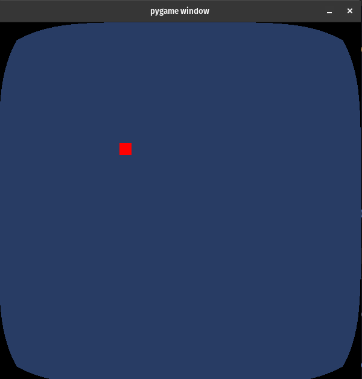

Screen Shaders
===================

The most basic pygame_shaders shader type is the DefaultScreenShader, this shader allows us to draw a pygame surface
directly onto an OpenGL initialized display.

.. code-block:: python
    
    #An opengl initialized display     
    screen = pygame.display.set_mode((WIDTH, HEIGHT), pygame.OPENGL | pygame.DOUBLEBUF) 
    
    #This will be the display to which we do regular pygame drawing.
    display = pygame.Surface((WIDTH, HEIGHT)) 
    
    #In order to draw the contents of display onto the OpenGL display, we need a ScreenShader
    screen_shader = pygame_shaders.DefaultScreenShader(display) #Here we specify the surface which we want to place onto the OpenGL display.

With our created screen shader, we now have the ability to render whatever we place on our display surface onto the OpenGL display.

.. code-block:: python

    #Your previous code here...

    screen_shader.render()

    clock.tick()
    pygame.display.flip()

While the DefaultScreenShader can be useful to quickly get the contents of the display rendered. It will not provide sufficient if the user wants to apply a custom shader to the display before rendering it. For that we are going to need to setup a custom shader. 

.. code-block:: python

    import pygame
    import pygame_shaders
    import glm

    pygame.init()

    clock = pygame.time.Clock()

    #Create an opengl pygame Surface, this will act as our opengl context.  
    screen = pygame.display.set_mode((600, 600), pygame.OPENGL | pygame.DOUBLEBUF)

    #This is our main display we will do all of our standard pygame rendering on.
    display = pygame.Surface((600, 600))

    #The shader we are using to communicate with the opengl context (standard pygame drawing functionality does not work on opengl displays)
    screen_shader = pygame_shaders.Shader(pygame_shaders.DEFAULT_VERTEX_SHADER, "screen_frag.glsl", display) # <- Here we supply our default display, it's this display which will be displayed onto the opengl context via the screen_shader

    while True:
        #Fill the display with white
        display.fill((255, 255, 255))
        
        #Standard pygame event stuff
        for event in pygame.event.get():
            if event.type == pygame.QUIT:
                pygame.quit()

        #Render a rect onto the display using the standard pygame method for drawing rects.
        pygame.draw.rect(display, (255, 0, 0), (200, 200, 20, 20))
        
        #Render the contents of "display" (main surface) onto the opengl screen.
        screen_shader.render_direct(pygame.Rect(0, 0, 600, 600)) 

        #Update the opengl context
        pygame.display.flip()
        clock.tick(60)

screen_frag.glsl:

.. code-block:: glsl

    #version 330 core
    uniform sampler2D image;

    out vec4 color;
    in vec2 fragmentTexCoord;

    void main() {
        vec2 center = vec2(0.5, 0.5);
        vec2 off_center = fragmentTexCoord - center;

        off_center *= 1.0 + 8.8 * pow(abs(off_center.yx), vec2(5.5));

        vec2 v_text2 = center+off_center;

        if (v_text2.x > 1.0 || v_text2.x < 0.0 || v_text2.y > 1.0 || v_text2.y < 0.0)
            color = vec4(0.0, 0.0, 0.0, 1.0);
        else 
            color = vec4(texture(image, v_text2).rgb, 1.0);
    }

produces:

Here we are essentially creating our own version of the screen shader class. We are once again using render_direct in order to render the contents of the given pygame surface (display in this case) onto the OpenGL display.
We are specifying our own fragment shader which instead of simpily calling texture() on the given sampler will additionally mesaure the distance of the current pixel to the center of the screen and make changes accordingly (In this case giving a stretched effect.)