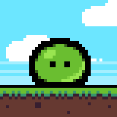
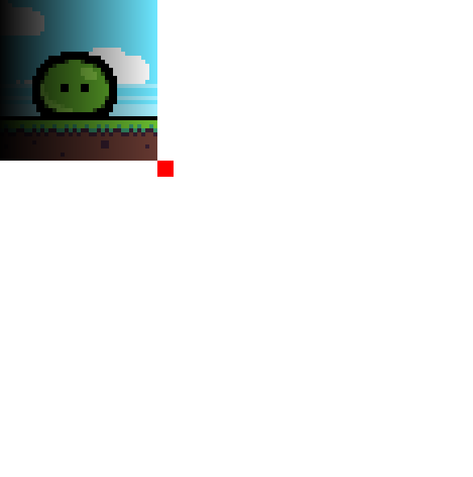

Surface Shaders
=================

So far we have looked at how we can apply shaders to pygame Surface objects and render them directly onto the OpenGL initialized display. However what if we instead want to produce a new pygame Surface object for usage elsewhere?

Instead of calling ``Shader.render_direct()`` to draw our shader, lets instead create a new "target surface" which we will give to our shader when we create it, and can later use for rendering:

.. code-block:: python

    import pygame
    import pygame_shaders
    import glm

    pygame.init()

    clock = pygame.time.Clock()

    #Create an opengl pygame Surface, this will act as our opengl context.  
    screen = pygame.display.set_mode((600, 600), pygame.OPENGL | pygame.DOUBLEBUF)

    #This is our main display we will do all of our standard pygame rendering on.
    display = pygame.Surface((600, 600))

    #The shader we are using to communicate with the opengl context (standard pygame drawing functionality does not work on opengl displays)
    screen_shader = pygame_shaders.DefaultScreenShader(display) # <- Here we supply our default display, it's this display which will be displayed onto the opengl context via the screen_shader

    #create our target surface
    target_surface = pygame.Surface((200, 200))

    shader = pygame_shaders.Shader(pygame_shaders.DEFAULT_VERTEX_SHADER, "custom_frag.glsl", target_surface) #<- give it to our shader

    while True:
        #Fill the display with white
        display.fill((255, 255, 255))
        
        #Standard pygame event stuff
        for event in pygame.event.get():
            if event.type == pygame.QUIT:
                pygame.quit()

        #Render a rect onto the display using the standard pygame method for drawing rects.
        pygame.draw.rect(display, (255, 0, 0), (200, 200, 20, 20))
        
        #Render the shader onto the surface object
        target_shader = shader.render() 

        #Blit the new (shader applied!) surface onto the display
        display.blit(target_shader, (0, 0))

        #Render the contents of "display" (main surface) onto the opengl screen.
        screen_shader.render() 

        #Update the opengl context
        pygame.display.flip()
        clock.tick(60)
    
you may notice here that unlike when we were using render_direct we place the call to shader render above the call to the screen shader render, thats because here the process of putting a shader onto the screen become a `part` of the regular pygame drawing process (since we are using a regular pygame blit to display it) and hence must be done `before` we render the display onto the OpenGL pygame Surface.

Lets run through another (more concrete) example. Imagine we have an image:

which we want to render with a shader. Lets start by writing our custom fragment shader:

custom_frag.glsl:

.. code-block:: glsl

    #version 330

    //Provided by the pygame_shaders library. Do not modify...
    in vec3 fragmentColor;
    in vec2 fragmentTexCoord;
    uniform sampler2D imageTexture;

    //Color output of the shader
    out vec4 color;

    //Note: Add your custom uniforms and variables here.

    void main() {
        color = texture(imageTexture, -fragmentTexCoord) * fragmentTexCoord.x;
    }

This shader will essentially render our image as normal (we are negating the provided fragment tex coord to account for the OpenGL coordiante system) but we additionally multiply the provided texture color with the x value of the current pixel coordinate.

Hooking this up to the previous program is simple. All we need to do is blit our image onto the surface.

.. code-block:: python
    
    #create our target surface
    target_surface = pygame.Surface((200, 200))
    target_surface.blit(pygame.image.load("image.png"))

    shader = pygame_shaders.Shader(pygame_shaders.DEFAULT_VERTEX_SHADER, "custom_frag.glsl", target_surface) #<- give it to our shader

Run our new program and voila!

